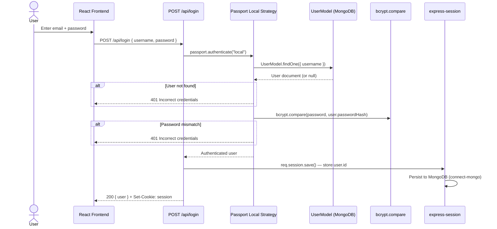
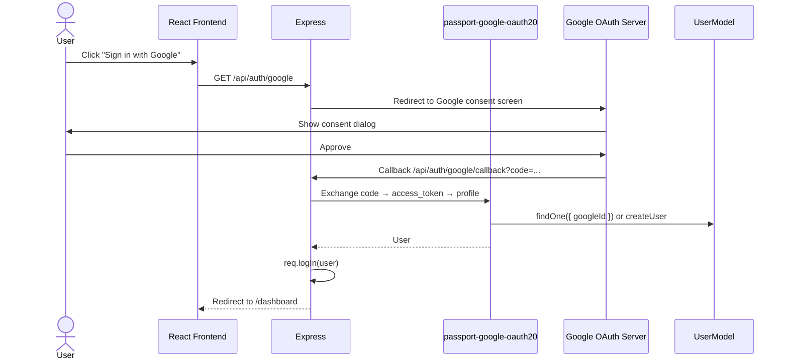
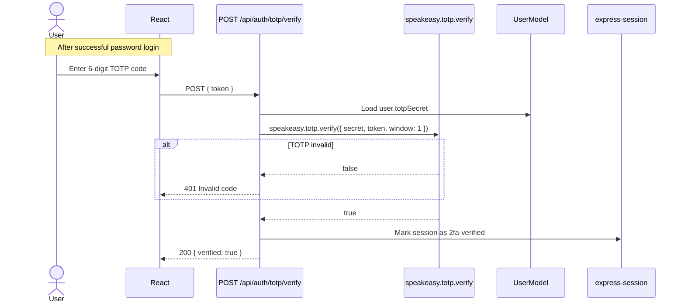
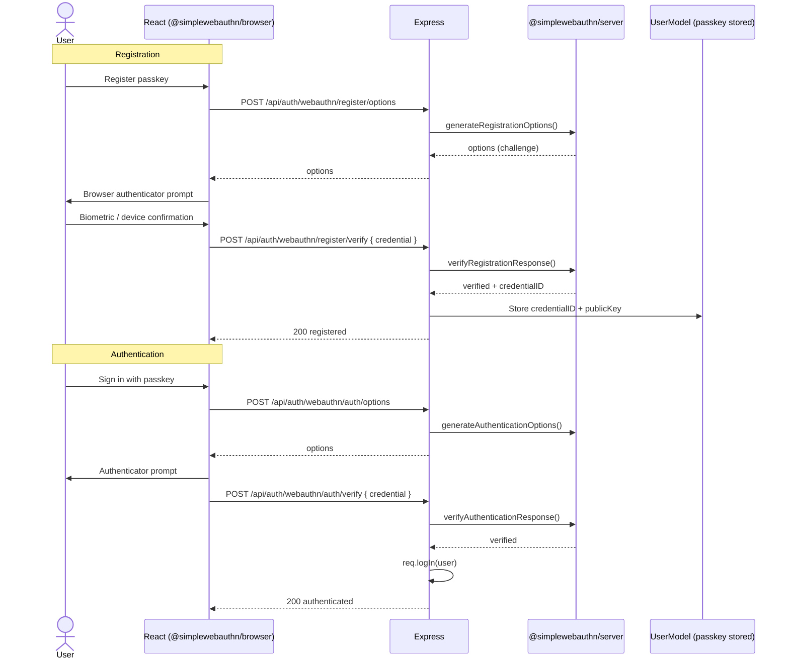
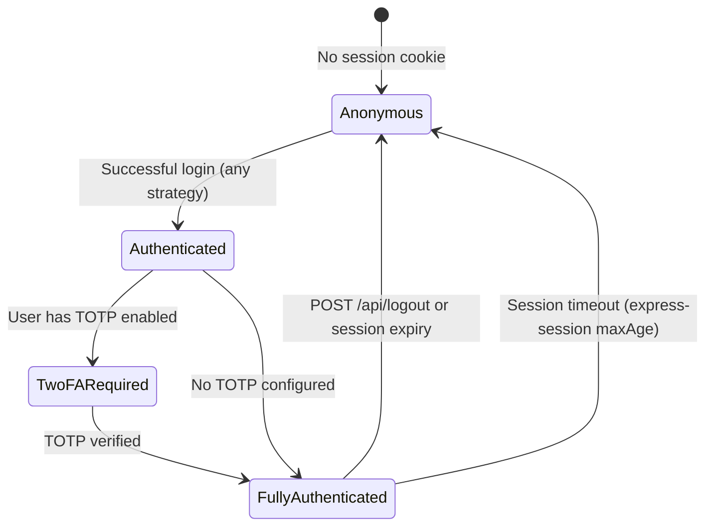

# Architecture Diagram — Authentication Flow

**Version:** 1.0  
**Last updated:** Enterprise Governance migration

---

## Local (Username / Password) Authentication



---

## Google OAuth Flow



---

## GitHub OAuth Flow (also used for DeploymentCloud)

```mermaid
sequenceDiagram
    actor U as User
    participant FE as React
    participant API as Express
    participant GH as GitHub OAuth
    participant DB as UserModel

    U->>FE: Click "Sign in with GitHub" or "Connect GitHub"
    FE->>API: GET /api/auth/github
    API->>GH: Redirect to GitHub authorize
    GH->>U: Consent screen
    U->>GH: Approve
    GH->>API: Callback /api/auth/github/callback
    API->>DB: Find or create user; store githubDeployToken
    API-->>FE: Redirect to /dashboard or /employee/deployment-cloud
```

---

## TOTP (Two-Factor Authentication)



---

## WebAuthn / Passkey Flow



---

## Session Lifecycle


