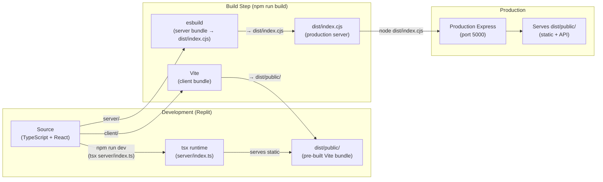
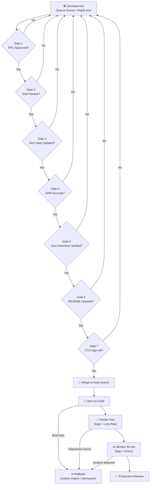
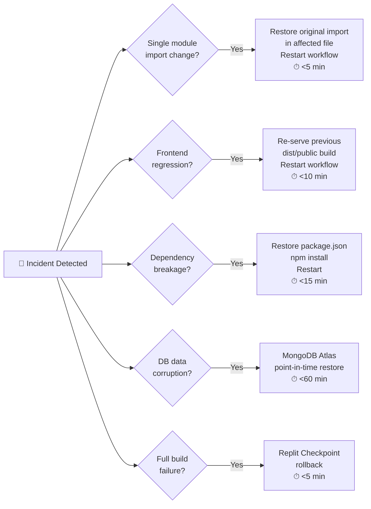
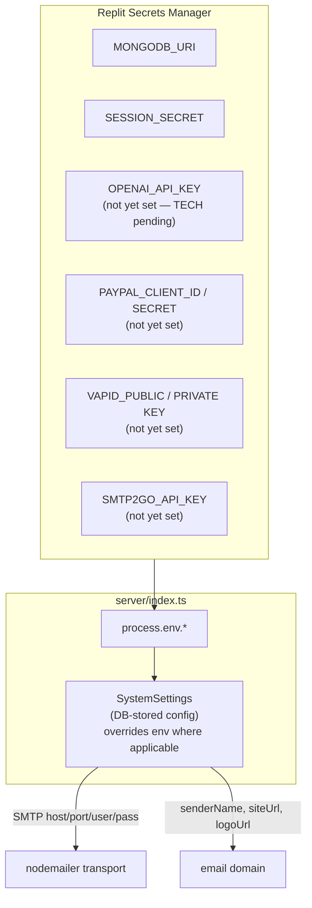
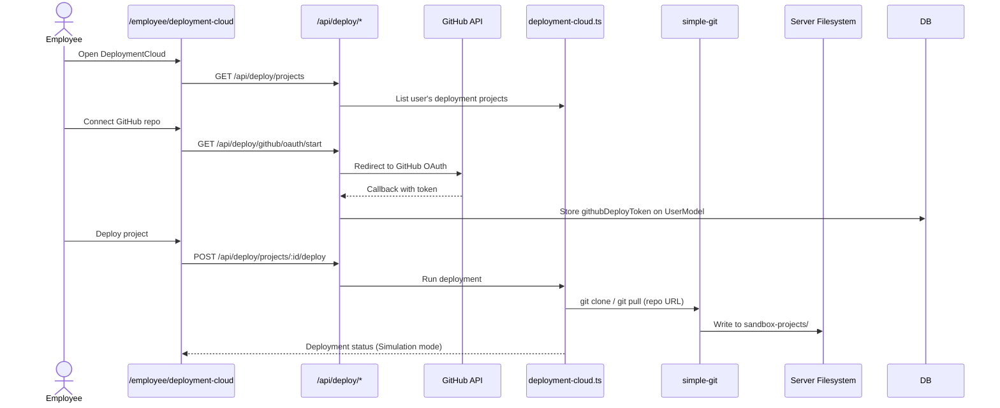

# Architecture Diagram — Deployment Flow

**Version:** 1.0  
**Last updated:** Enterprise Governance migration

---

## Build & Serve Architecture

> ⚠️ **Environment Note:** Vite HMR is disabled in this Replit environment due to a SIGBUS crash.
> The dev workflow serves a **pre-built** `dist/public/` bundle instead of running Vite live.
> See: `.agents/memory/vite-sigbus-crash.md`

---

## Release Deployment Flow

---

## Rollback Strategy by Scenario

---

## Environment Variable / Secrets Architecture

---

## DeploymentCloud Sub-System

