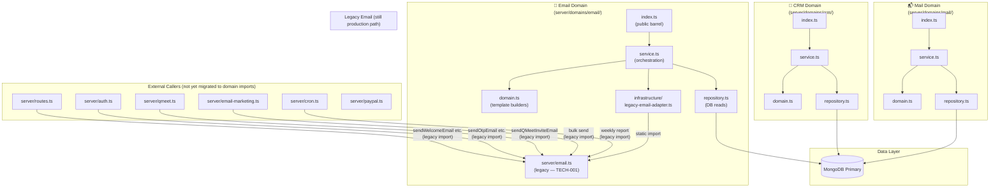
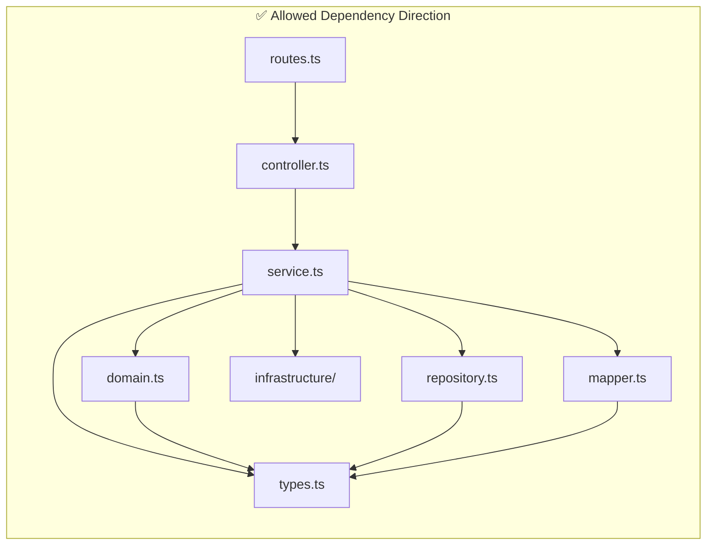
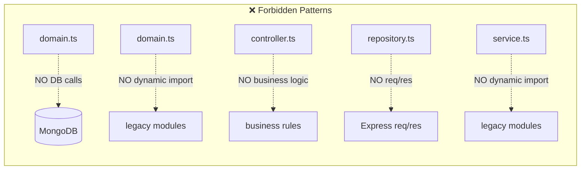
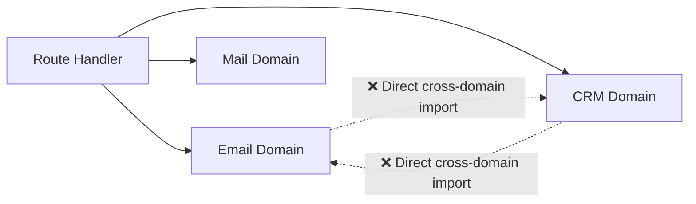

# Architecture Diagram — Domain Interaction

**Version:** 1.0  
**Last updated:** Enterprise Governance migration

---

## Domain Layer Architecture

---

## Domain Internal Layer Rules (ADR-001)

---

## Cross-Domain Communication Rule

Domains **do not import from each other directly**.
Cross-domain coordination is handled at the service layer via the calling route handler,
or via shared utility functions in `server/utils.ts`.

