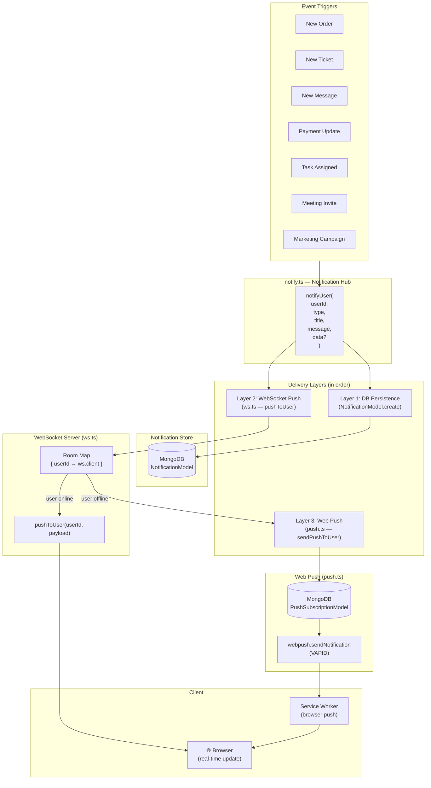
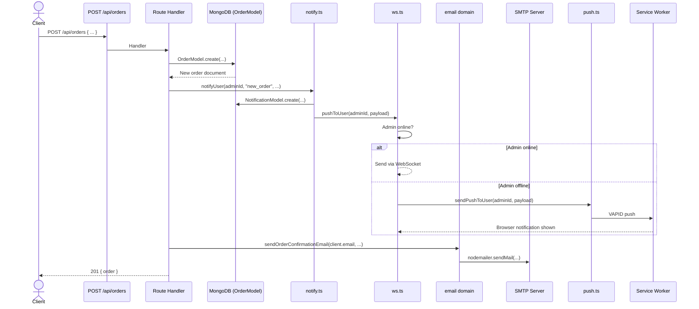
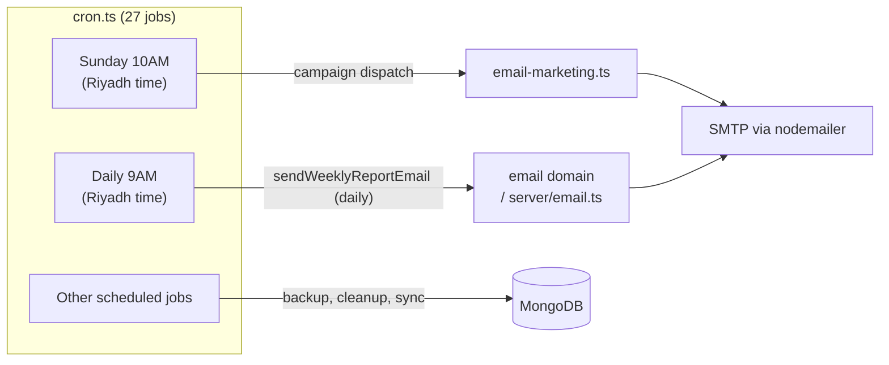
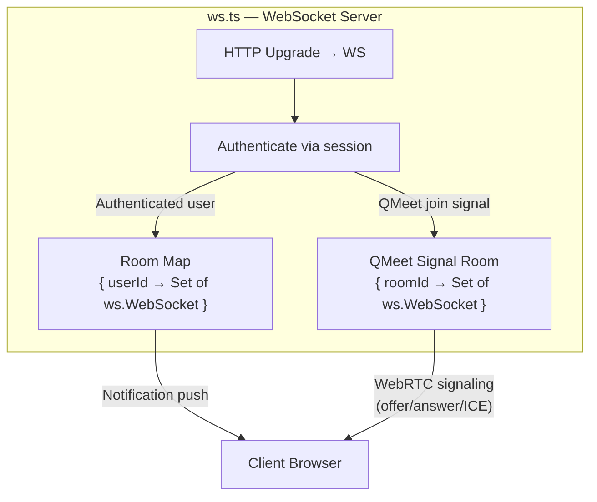

# Architecture Diagram — Event & Notification Flow

**Version:** 1.0  
**Last updated:** Enterprise Governance migration

---

## Notification Delivery Architecture

---

## Event Flow — New Order Example

---

## Cron-Triggered Events

---

## WebSocket Room Management

