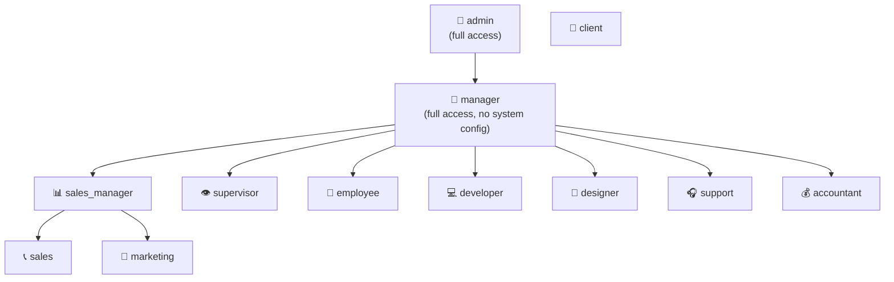
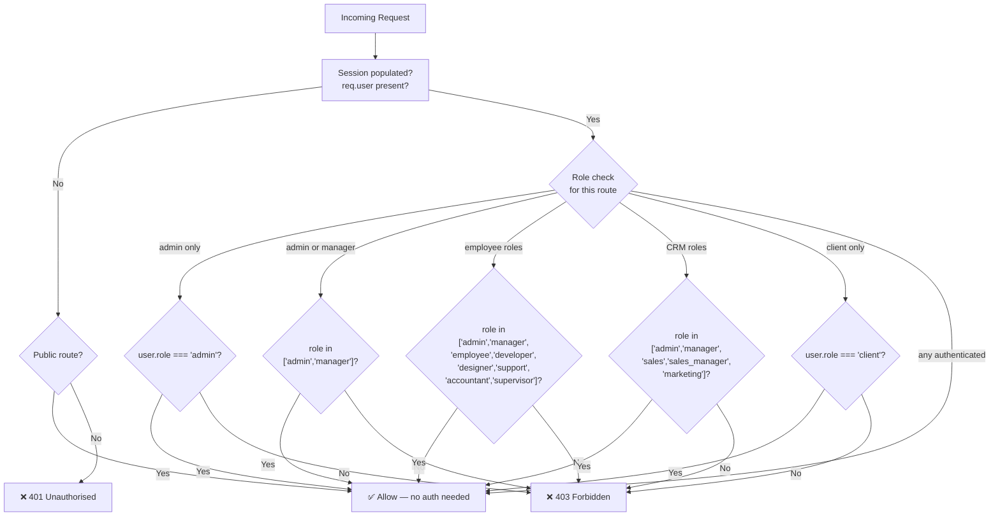
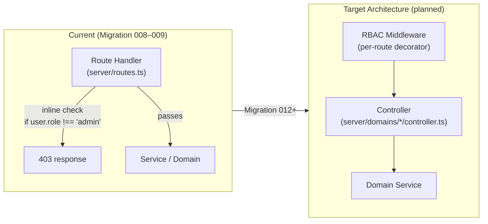

# Architecture Diagram — Permission Flow

**Version:** 1.0  
**Last updated:** Enterprise Governance migration

---

## Role Hierarchy

---

## Request Permission Check Flow

---

## Route Access Matrix

| Route Group | admin | manager | employee* | sales* | client |
|---|:---:|:---:|:---:|:---:|:---:|
| `/api/admin/*` | ✅ | ✅ | ❌ | ❌ | ❌ |
| `/api/employee/*` | ✅ | ✅ | ✅ | ✅ | ❌ |
| `/api/client/*` | ✅ | ✅ | ❌ | ❌ | ✅ |
| `/api/crm/*` | ✅ | ✅ | ❌ | ✅ | ❌ |
| `/api/ai/*` | ✅ | ✅ | ✅ | ❌ | ❌ |
| `/api/qmeet/*` | ✅ | ✅ | ✅ | ❌ | ✅ |
| `/api/public/*` | ✅ | ✅ | ✅ | ✅ | ✅ |
| `/api/auth/*` | ✅ | ✅ | ✅ | ✅ | ✅ |

_*employee includes: developer, designer, support, accountant, supervisor_  
_*sales includes: sales, sales_manager, marketing_

---

## Permission Enforcement Architecture

**Current state:** Role checks are inline inside `server/routes.ts` handlers.  
**Target state:** A reusable `requireRole(...roles)` middleware factory applied at route registration.  
This is an architectural improvement tracked as a future migration (no TECH-ID yet; low risk in current form).

---

## Public Route Whitelist

Routes accessible without authentication:

| Pattern | Purpose |
|---|---|
| `/api/public/*` | Public-facing data (settings, pricing, news) |
| `/api/auth/login` | Login endpoint |
| `/api/auth/register` | Registration |
| `/api/auth/google*` | Google OAuth callbacks |
| `/api/auth/github*` | GitHub OAuth callbacks |
| `/api/auth/apple*` | Apple OAuth callbacks |
| `/api/auth/webauthn*` | Passkey flows |
| `/api/prices` | Pricing page data |
| `/api/news*` | Public news |
| `/api/partners` | Partners list |
| `/api/jobs*` | Job listings |
| `/uploads/*` | Uploaded files (public CDN) |
| `/*` (non-API) | React SPA shell (auth handled client-side) |
