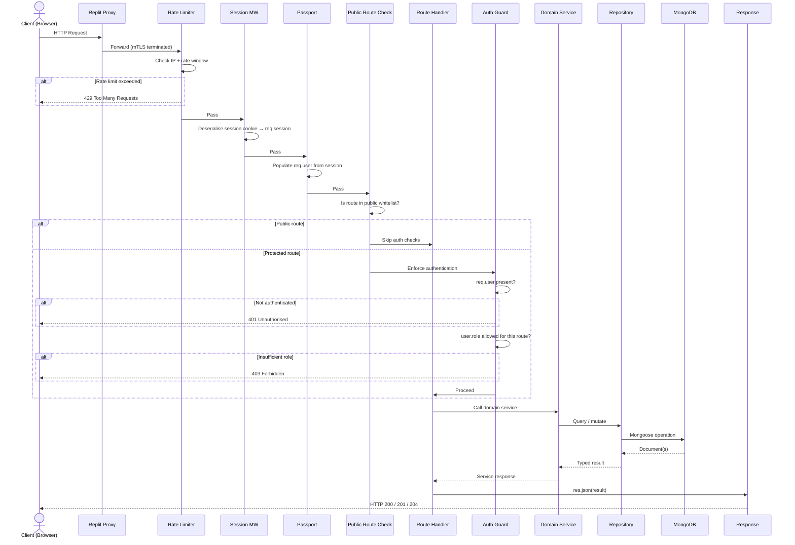
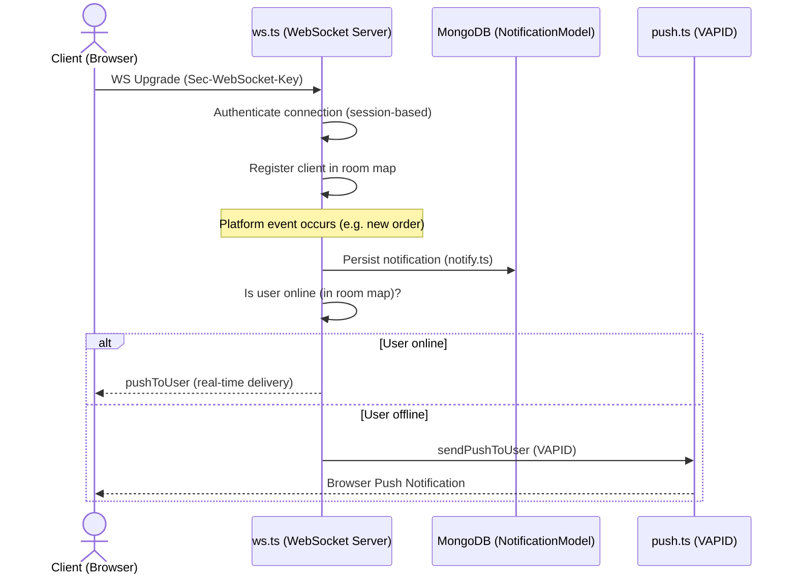
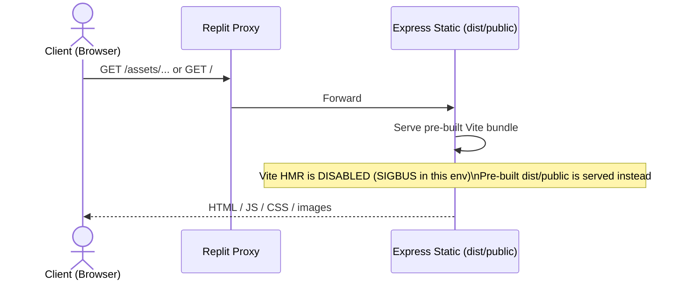

# Architecture Diagram — Request Lifecycle

**Version:** 1.0  
**Last updated:** Enterprise Governance migration

---

## Full Request Lifecycle

---

## WebSocket Request Lifecycle

---

## Static Asset Request Lifecycle

