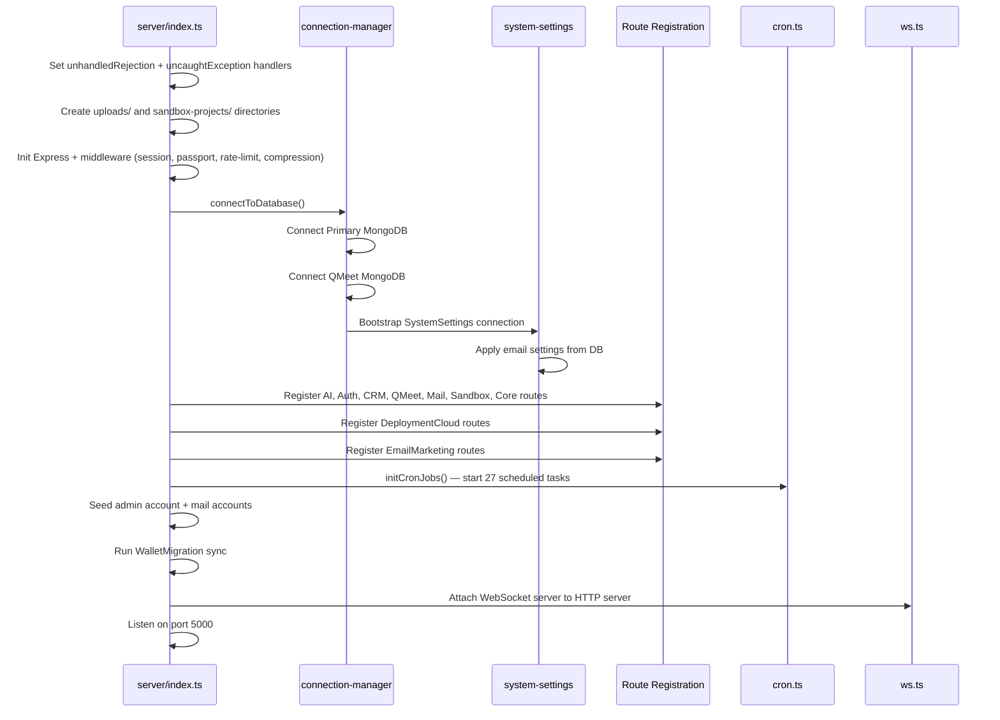

# Architecture Diagram — System Overview

**Version:** 1.0  
**Last updated:** Enterprise Governance migration

---

## System Overview

```mermaid
graph TB
    subgraph Clients["Client Layer"]
        B["🌐 Browser\n(React SPA)"]
        M["📱 Mobile\n(Capacitor)"]
    end

    subgraph Edge["Edge / Proxy"]
        RP["Replit Reverse Proxy\n(mTLS, port 5000)"]
    end

    subgraph Server["Express Server (Node.js / tsx)"]
        direction TB
        MW["Middleware Stack\n(session · passport · rate-limit · compression)"]

        subgraph Routes["Route Layer"]
            AR["API Routes\n(server/routes.ts)"]
            AuthR["Auth Routes\n(server/auth.ts)"]
            AIR["AI Routes\n(server/ai.ts)"]
            QMR["QMeet Routes\n(server/qmeet.ts)"]
            MailR["Mail Routes\n(server/routes-mail.ts)"]
            DC["DeploymentCloud\n(server/deployment-cloud.ts)"]
            EMR["Email-Marketing Routes\n(server/email-marketing.ts)"]
            SBR["Sandbox Routes\n(server/sandbox-routes.ts)"]
        end

        subgraph Domains["Domain Layer"]
            ED["email domain"]
            CD["crm domain"]
            MD["mail domain"]
        end

        subgraph Platform["Platform Services"]
            Notify["notify.ts\n(notification hub)"]
            Push["push.ts\n(web push)"]
            WS["ws.ts\n(WebSocket)"]
            Cron["cron.ts\n(27 jobs)"]
            PDF["pdf.ts"]
            Cache["cache.ts\n(in-memory TTL)"]
            SysSet["system-settings.ts"]
        end
    end

    subgraph Data["Data Layer"]
        MongoDB[("MongoDB Primary\n(Mongoose)")]
        QMeetDB[("MongoDB QMeet\n(separate cluster)")]
        Sessions[("MongoDB Sessions\n(connect-mongo)")]
    end

    subgraph External["External Services"]
        SMTP["SMTP Server\n(nodemailer)"]
        OAI["OpenAI / Moonshot\n(AI)"]
        PayPal["PayPal\n(payments)"]
        GSheets["Google Sheets"]
        GHub["GitHub\n(OAuth + deploy)"]
        GAuth["Google OAuth"]
        Apple["Apple Sign-In"]
        IMAP["IMAP Server\n(imapflow)"]
        VapidPush["Browser Push\n(VAPID)"]
        CPanel["cPanel API\n(digest-fetch)"]
    end

    B & M --> RP
    RP --> MW
    MW --> Routes
    Routes --> Domains
    Routes --> Platform
    Domains --> Data
    Platform --> Data
    Platform --> External
    Routes --> External
```

---

## Startup Sequence

```mermaid
sequenceDiagram
    participant idx as server/index.ts
    participant db as connection-manager
    participant sys as system-settings
    participant routes as Route Registration
    participant cron as cron.ts
    participant ws as ws.ts

    idx->>idx: Set unhandledRejection + uncaughtException handlers
    idx->>idx: Create uploads/ and sandbox-projects/ directories
    idx->>idx: Init Express + middleware (session, passport, rate-limit, compression)
    idx->>db: connectToDatabase()
    db->>db: Connect Primary MongoDB
    db->>db: Connect QMeet MongoDB
    db->>sys: Bootstrap SystemSettings connection
    sys->>sys: Apply email settings from DB
    idx->>routes: Register AI, Auth, CRM, QMeet, Mail, Sandbox, Core routes
    idx->>routes: Register DeploymentCloud routes
    idx->>routes: Register EmailMarketing routes
    idx->>cron: initCronJobs() — start 27 scheduled tasks
    idx->>idx: Seed admin account + mail accounts
    idx->>idx: Run WalletMigration sync
    idx->>ws: Attach WebSocket server to HTTP server
    idx->>idx: Listen on port 5000
```
