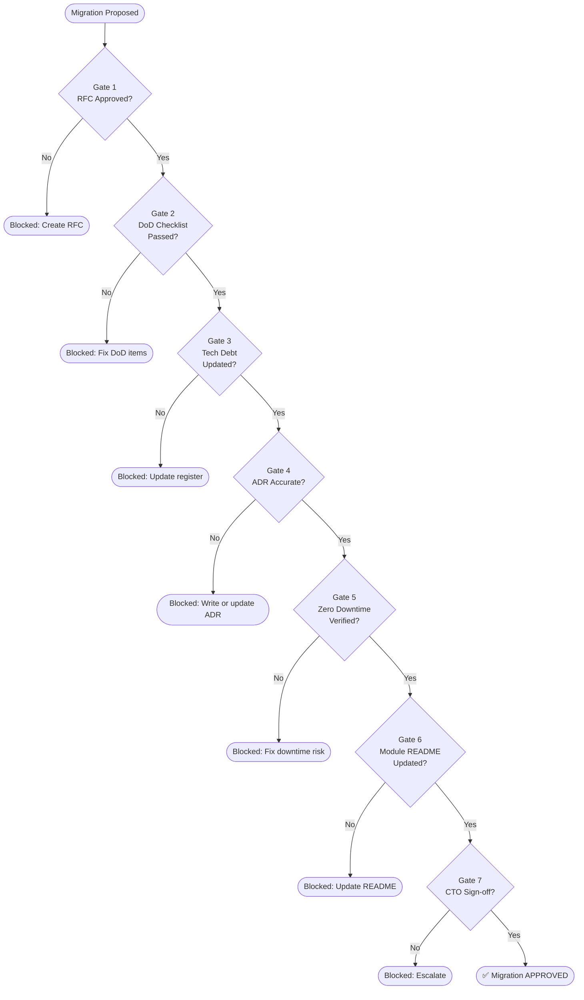

# Migration Gate — QIROX Platform

**Version:** 1.0  
**Effective from:** Enterprise Governance migration  
**Owner:** CTO

---

## Purpose

No migration may be marked `APPROVED` or `IMPLEMENTED` unless every gate
in this document passes. This is non-negotiable. A migration that fails any
gate must be remediated before proceeding.

The Migration Gate is the governance-level enforcement of the
Definition of Done (`docs/definition-of-done.md`). Where the DoD specifies
*what* to check, the Migration Gate specifies *who approves* and *what evidence is required*.

---

## Gate Overview

---

## Gate 1 — RFC Approved

**Evidence required:** The RFC for this migration exists in `docs/governance/rfc/`
with status `APPROVED` and a completed CTO approval entry in Section 8.

**Responsible:** Author

**Exception:** The first migration after the RFC framework was introduced
(Enterprise Governance migration) is grandfathered. All subsequent migrations require an RFC.

---

## Gate 2 — Definition of Done Checklist Passed

**Evidence required:** Every item in `docs/definition-of-done.md` is checked
and confirmed in the migration's verification report.

Mandatory items (must all pass):

| # | Check |
|---|---|
| 2.1 | `npm run build` exits 0 |
| 2.2 | `npx tsc --noEmit --skipLibCheck` exits 0 with no new errors |
| 2.3 | No new ESLint violations |
| 2.4 | No dynamic imports inside domain layer files |
| 2.5 | No direct DB calls from service layer |
| 2.6 | No HTTP req/res objects inside service or domain |
| 2.7 | No inline business rules in controllers |
| 2.8 | No duplicate business logic introduced |
| 2.9 | Rollback strategy is documented and viable |
| 2.10 | No breaking API changes |
| 2.11 | No breaking DB schema changes |
| 2.12 | No hidden breaking changes |
| 2.13 | Expected downtime: ZERO |
| 2.14 | App starts cleanly after changes |
| 2.15 | New modules verified with tsx import test |

**Responsible:** Author self-certifies; Engineering reviewer confirms.

---

## Gate 3 — Technical Debt Register Updated

**Evidence required:** 
- Any new workaround, temporary solution, or deferred item introduced by this
  migration has a TECH-ID in `docs/tech-debt-register.md`.
- Any TECH-IDs resolved by this migration are marked as closed with a date.
- The next available TECH-ID is updated in the register.

**Responsible:** Author

---

## Gate 4 — ADR Accurate

**Evidence required:**
- If this migration introduces a new architectural decision: a new ADR exists
  in `docs/adr/` with status `Accepted`.
- If this migration changes an existing decision: the relevant ADR is amended
  with a dated addendum.
- If this migration follows only existing decisions: a note in the RFC confirming
  this (no new ADR required).

**Responsible:** Author

---

## Gate 5 — Zero Downtime Verified

**Evidence required:**
- The verification report explicitly states: `Expected Downtime: ZERO`.
- The app was restarted after all changes and came up cleanly (logs provided).
- The module import test passed (tsx eval).
- No existing API or UI behavior was altered.

**Responsible:** Author

**Hard stop:** If downtime was non-zero (even briefly), the migration cannot be
marked complete until root cause is found and the Release Governance rollback
policy is applied.

---

## Gate 6 — Module README Updated

**Evidence required:**
- The `README.md` of every domain or module touched by this migration is updated
  to reflect the new state (public API, dependencies, future migrations, tech debt).
- If a new domain is created: its `README.md` is complete per the template in
  `docs/governance/MODULE-OWNERSHIP.md`.

**Responsible:** Author

---

## Gate 7 — CTO Sign-off

**Evidence required:**
- CTO has reviewed the verification report.
- CTO has confirmed the RFC is updated to `IMPLEMENTED`.
- Module Ownership Register and Stability Index scores are updated.

**Responsible:** CTO

---

## Non-Negotiable Rules

The following actions are permanently blocked regardless of any gate status:

| Action | Reason |
|---|---|
| Delete an active production route | Violates ADR-002 (additive-only) |
| Rename an existing API endpoint | Violates ADR-002 |
| Drop or rename a MongoDB field | Violates ADR-002 |
| Remove a production page | Violates ADR-002 |
| Use `await import()` inside domain layer | Violates ADR-003 |
| Copy business logic between modules | Violates DoD item 2.8 |
| Ship without a rollback strategy | Violates DoD item 2.9 |

Violations of any of the above require a full rollback, a retrospective RFC,
and a post-mortem before the next migration is permitted to begin.
