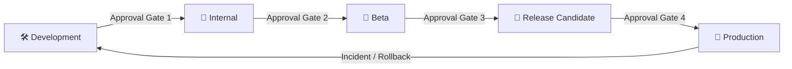

# Release Governance — QIROX Platform

**Version:** 1.0  
**Owner:** CTO  
**Last updated:** Enterprise Governance migration

---

## Release Lifecycle

Every production change flows through the following stages. No stage may be
skipped except under the Fast-Track policy (see below).



---

## Stage Definitions

### 🛠 Development

**Who:** Individual engineer or pair  
**Where:** Feature branch / Replit environment  
**Purpose:** Build and verify the change in isolation

**Activities:**
- Code implementation per RFC design
- Unit/integration verification (manual; automated if tests exist)
- DoD checklist self-review
- TypeScript, build checks

**Exit criteria (Approval Gate 1):**
- [ ] Build passes
- [ ] TypeScript passes (no new errors)
- [ ] No new ESLint violations
- [ ] RFC Section 6 (Rollback Strategy) is complete
- [ ] Tech Debt Register updated
- [ ] ADRs updated if applicable
- [ ] Domain README updated
- [ ] All changes are additive — no API or DB breakage
- [ ] App starts cleanly in dev environment

---

### 🔬 Internal

**Who:** Engineering team  
**Where:** Shared internal environment  
**Purpose:** Cross-engineer review; catch regressions missed by the author

**Activities:**
- Code review against RFC design
- Manual smoke test of all affected workflows
- Verify rollback procedure works

**Exit criteria (Approval Gate 2):**
- [ ] Code review approved by at least one engineer not the author
- [ ] All affected features manually tested
- [ ] Rollback procedure verified (can actually be executed)
- [ ] No regressions in existing functionality
- [ ] Migration Gate checklist complete (`docs/governance/MIGRATION-GATE.md`)

---

### 🧪 Beta

**Who:** Trusted internal users / stakeholders  
**Where:** Beta environment (production data mirror or staging)  
**Purpose:** Real-usage validation before wider release

**Activities:**
- Feature demonstration to stakeholders
- Business validation (does it solve the stated problem?)
- Performance observation under real data volumes

**Exit criteria (Approval Gate 3):**
- [ ] Stakeholder sign-off
- [ ] No critical or high-severity bugs discovered
- [ ] Performance within acceptable bounds
- [ ] Zero downtime confirmed throughout testing period

---

### 🎯 Release Candidate

**Who:** CTO / Engineering lead  
**Where:** RC environment or production-equivalent  
**Purpose:** Final verification; last chance to rollback without user impact

**Activities:**
- Full regression sweep
- Security review for changes touching auth, payments, data
- RFC Section 9 (Implementation Notes) filled in
- Release notes drafted

**Exit criteria (Approval Gate 4 — CTO sign-off):**
- [ ] All previous gates passed
- [ ] RFC status updated to `IMPLEMENTED`
- [ ] Release notes approved
- [ ] Rollback plan rehearsed if change is high-risk
- [ ] CTO explicit approval

---

### 🚀 Production

**Who:** Engineering  
**Where:** Live production environment  
**Purpose:** Deliver value to end users

**Post-deployment checklist:**
- [ ] App starts cleanly; all services up in logs
- [ ] MongoDB connections confirmed
- [ ] Smoke test: login, core feature, email (if applicable)
- [ ] Monitoring active for 30 minutes post-deploy
- [ ] Rollback window: 2 hours (engineer on standby)
- [ ] RFC index updated with completion date

---

## Rollback Policy

| Scenario | Rollback Mechanism | Max Time |
|---|---|---|
| App fails to start | Restore previous `server/index.ts` or relevant module | < 5 min |
| API regression | Revert import to legacy module; restart | < 5 min |
| DB data corruption | Restore from MongoDB Atlas backup | < 60 min |
| Frontend regression | Re-serve previous `dist/public` build | < 10 min |
| Dependency issue | Restore `package.json` + `npm install` | < 15 min |

**Rollback authority:** Any engineer may initiate a rollback without CTO approval if a
production incident is confirmed. CTO is notified immediately after.

**Post-rollback:** A retrospective RFC is required within 5 business days documenting
the root cause and the corrective design.

---

## Fast-Track Policy

For emergency security patches or critical production fixes only:

1. Change must be limited to a single file or single dependency update.
2. Implement and deploy directly.
3. Create a retrospective RFC within 5 business days.
4. Register any new workaround in the Tech Debt Register immediately.

Fast-track does **not** apply to: new features, schema changes, API changes, domain extractions.

---

## Versioning Scheme

`MAJOR.MINOR.PATCH` — tracked in `server/changelog.ts` (current: v5.4.0)

| Increment | When |
|---|---|
| PATCH | Bugfix; no API or feature change |
| MINOR | New feature behind feature flag; additive API change |
| MAJOR | Breaking change (requires CTO approval and full RFC) |

---

## Deployment Checklist (Production)

Run this checklist for every production deployment:

```
PRE-DEPLOY
  [ ] RFC approved and DoD passed
  [ ] Release notes written
  [ ] Rollback procedure documented and understood
  [ ] Database backup confirmed (Atlas continuous backup)
  [ ] Engineer on standby for 2-hour window

DEPLOY
  [ ] Apply changes (import swap / workflow restart)
  [ ] Monitor startup logs — confirm all services healthy
  [ ] Confirm MongoDB connections live

POST-DEPLOY (first 30 minutes)
  [ ] Login flow works
  [ ] Core affected feature works end-to-end
  [ ] No new errors in application logs
  [ ] No unexpected spikes in error rate

SIGN-OFF
  [ ] CTO notified of successful deployment
  [ ] RFC status updated to IMPLEMENTED
  [ ] Version bump committed
```
