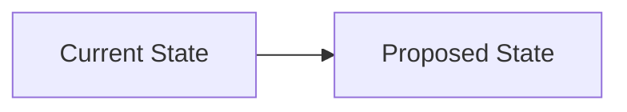

# RFC-XXXX — [Title]

> **Request For Change**  
> Use this template for every proposed change to production architecture,
> APIs, database schemas, domain boundaries, or platform dependencies.
> Copy this file to `RFC-XXXX-short-title.md` and fill in every section.

---

## Header

| Field | Value |
|---|---|
| **RFC ID** | RFC-XXXX |
| **Title** | [Short, imperative title — e.g. "Extract Payment Domain"] |
| **Author** | [Name / role] |
| **Created** | YYYY-MM-DD |
| **Status** | `DRAFT` |
| **Priority** | `LOW` / `MEDIUM` / `HIGH` / `CRITICAL` |
| **Type** | `FEATURE` / `REFACTOR` / `BUGFIX` / `SECURITY` / `INFRASTRUCTURE` / `DOCUMENTATION` |
| **Target Migration** | Migration NNN |
| **Supersedes** | RFC-XXXX (if applicable) |
| **Blocked By** | RFC-XXXX (if applicable) |

---

## 1. Summary

_One paragraph. What is changing, why, and what the outcome is._

---

## 2. Motivation

_Why is this change needed now? What problem does it solve?
Link to any relevant TECH-IDs, incidents, or ADRs._

**TECH debt addressed:** TECH-XXX, TECH-XXX  
**ADR superseded/created:** ADR-XXX  
**Related incidents:** (none / describe)

---

## 3. Detailed Design

_Describe the change precisely. Include:_

- What files will be created
- What files will be modified (with a summary of changes)
- What files will be deleted (if any)
- New API endpoints or schema changes
- Any new dependencies introduced

### 3.1 Architecture Impact

_How does this affect the system architecture? Reference a Mermaid diagram if helpful._

### 3.2 Database Impact

_List any collection/field additions (must be additive-only per ADR-002)._

| Collection | Field | Type | Nullable | Default | Breaking? |
|---|---|---|---|---|---|
| — | — | — | — | — | No |

### 3.3 API Impact

_List any new or modified endpoints._

| Method | Path | Change | Breaking? |
|---|---|---|---|
| — | — | — | No |

---

## 4. Alternatives Considered

_What other approaches were evaluated? Why were they rejected?_

| Option | Reason Rejected |
|---|---|
| Option A | — |
| Option B | — |

---

## 5. Risk Assessment

| Risk | Likelihood | Impact | Mitigation |
|---|---|---|---|
| — | LOW/MED/HIGH | LOW/MED/HIGH | — |

**Overall risk:** `LOW` / `MEDIUM` / `HIGH`

---

## 6. Rollback Strategy

_Exactly how to revert this change if it causes a production issue._

1. Step 1 — (e.g. restore import in `server/index.ts`)
2. Step 2 — (e.g. restart workflow)
3. Maximum rollback time: _N minutes_

**Rollback type:** `SINGLE-FILE` / `MULTI-FILE` / `REQUIRES-DB-MIGRATION` / `REQUIRES-DEPLOY`

---

## 7. Definition of Done

The following items must ALL be checked before this RFC moves to `APPROVED`:

- [ ] Build passes (`npm run build`)
- [ ] TypeScript passes (`npx tsc --noEmit --skipLibCheck`)
- [ ] No new ESLint violations
- [ ] Rollback documented (Section 6 complete)
- [ ] Technical Debt Register updated
- [ ] ADR created or updated if applicable
- [ ] Domain README updated
- [ ] Zero downtime verified
- [ ] No duplicate business logic introduced
- [ ] No hidden breaking changes
- [ ] Migration Gate checklist passed (see `docs/governance/MIGRATION-GATE.md`)

---

## 8. Approval

| Role | Name | Decision | Date | Notes |
|---|---|---|---|---|
| **CTO** | — | `PENDING` / `APPROVED` / `REJECTED` | — | — |
| **Engineering** | — | `PENDING` / `APPROVED` / `REJECTED` | — | — |

**Final Status:** `DRAFT` → `IN-REVIEW` → `APPROVED` / `REJECTED` / `WITHDRAWN`

---

## 9. Implementation Notes

_Filled in after approval, during or after implementation._

- Actual files changed: 
- Deviations from design:
- New TECH items introduced:
- Completion date:
