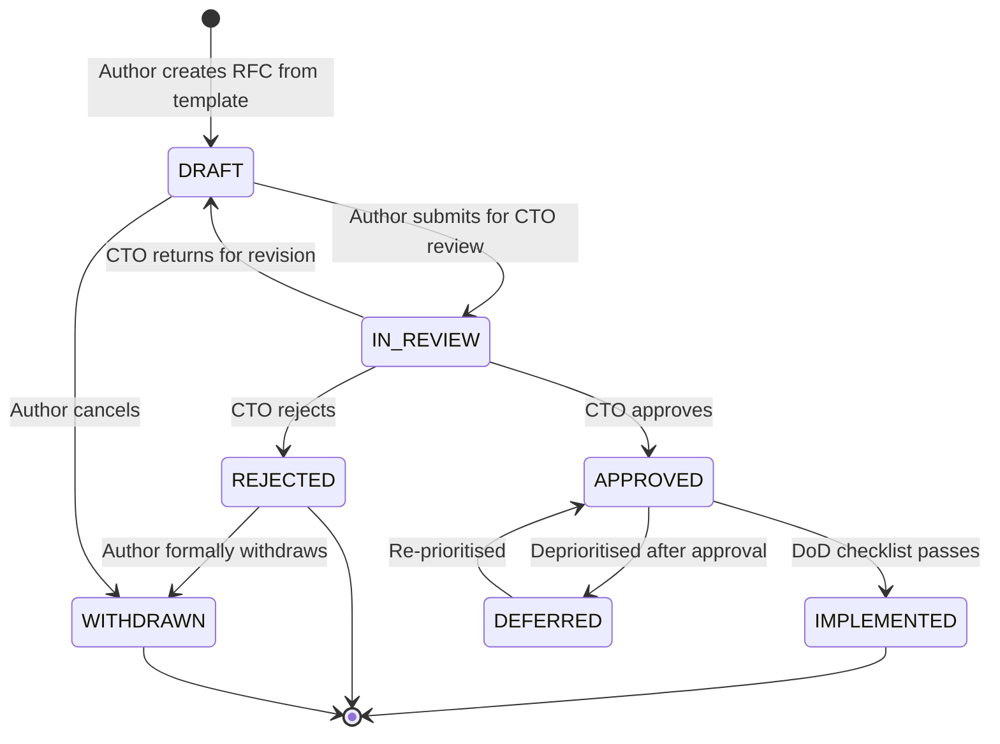

# RFC Workflow — Approval Process & Status Lifecycle

---

## Status Lifecycle

---

## Workflow Steps

### Step 1 — Authoring (`DRAFT`)

1. Copy `RFC-TEMPLATE.md` to `RFC-XXXX-short-title.md` (claim next ID from index).
2. Fill in all sections completely.
3. Add a row to `RFC-INDEX.md` with status `DRAFT`.
4. Self-review against the Definition of Done (`docs/definition-of-done.md`).
5. Ensure all relevant TECH-IDs and ADRs are referenced.

**Exit criteria:** All template sections are complete. Author is satisfied with design.

---

### Step 2 — Review (`IN-REVIEW`)

1. Update RFC status to `IN-REVIEW`.
2. Update index row.
3. Notify CTO for review.

**CTO review checklist:**
- [ ] Problem statement is clear and justified
- [ ] Design is technically sound
- [ ] Risk assessment is realistic
- [ ] Rollback strategy is viable (single-file or single-import)
- [ ] No breaking API or DB changes
- [ ] Zero downtime guaranteed
- [ ] DoD checklist is complete
- [ ] TECH-IDs and ADRs are referenced correctly

**Exit criteria:** CTO issues `APPROVED`, `REJECTED`, or returns to `DRAFT` with comments.

---

### Step 3 — Implementation (`APPROVED` → `IMPLEMENTED`)

1. Implementation follows the RFC design exactly.
2. Any deviation requires CTO addendum approval before proceeding.
3. On completion: fill in Section 9 (Implementation Notes).
4. Run full DoD checklist and confirm all items pass.
5. Update RFC status to `IMPLEMENTED`.
6. Update Tech Debt Register with any new TECH-IDs.
7. Update ADRs if architectural decisions changed.
8. Update index row.

**Exit criteria:** DoD checklist fully passed. App starts cleanly. Verification report delivered.

---

### Step 4 — Rejection (`REJECTED`)

1. CTO documents reason in RFC Section 8 (Approval).
2. RFC status updated to `REJECTED`.
3. Index row updated.
4. Author may revise and resubmit as a new RFC (reference the rejected one).
5. Rejected RFC is never deleted.

---

## Review SLA

| Priority | Target review time |
|---|---|
| `CRITICAL` | Same day |
| `HIGH` | Within 2 business days |
| `MEDIUM` | Within 5 business days |
| `LOW` | Next governance review cycle |

---

## Governance Review Cycle

A standing governance review occurs at the start of every major release cycle.
At minimum:
- All `IN-REVIEW` RFCs are resolved.
- All `DEFERRED` RFCs are re-evaluated.
- Stability Index scores are recalculated.
- Tech Debt Register is audited for closed items.
- Migration Gate criteria are reviewed for completeness.
